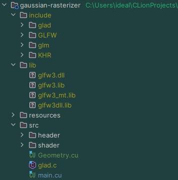

## Abstract
https://parkcymil.notion.site/Gaussian-Rasterizer-b4d2902d58c24e8280431579519e345d

## Contribute
### Install GLFW
1. Download [GLFW pre-compiled binaries](https://www.glfw.org/download.html) for Windows 64-bit
2. Unzip the file to extract `include` and `lib-vc2022` folders
3. Rename `lib-vc2022` to `lib`
4. Place the folders under the project root

### Install GLAD
1. Download [glad.zip](https://glad.dav1d.de/#language=c&specification=gl&api=gl%3D3.3&api=gles1%3Dnone&api=gles2%3Dnone&api=glsc2%3Dnone&profile=core&loader=on) from GLAD load generator
2. Unzip the file to extract `include` and `src` folders
3. Place them under the project root

### Install GLM
1. Download [glm-light.zip](https://github.com/g-truc/glm/releases)
2. Unzip the file to extract `glm` folder
3. Place it inside `include` under the project root

### Install FreeType2
1. Download [ft2132.zip](https://sourceforge.net/projects/freetype/files/freetype2/2.13.2/)
2. Unzip the file to extract `include` folder
3. Place it under the project root

### Project Structure

### Build project
1. Run CMake to build the project
2. The executable file will be generated under `deploy` folder
